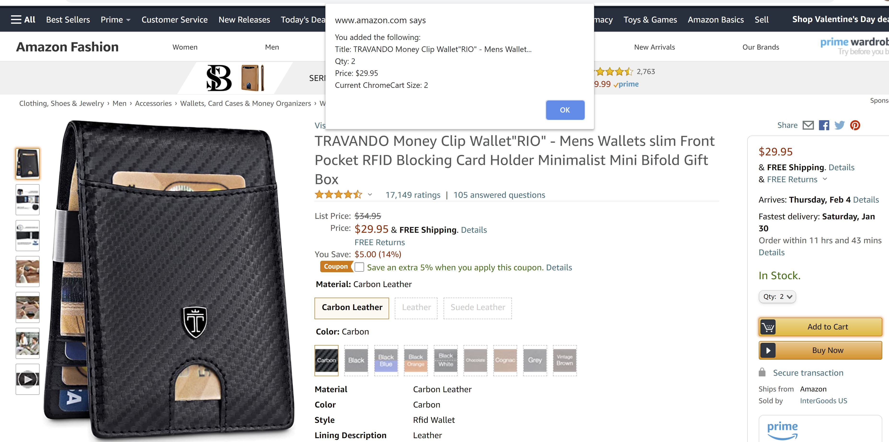
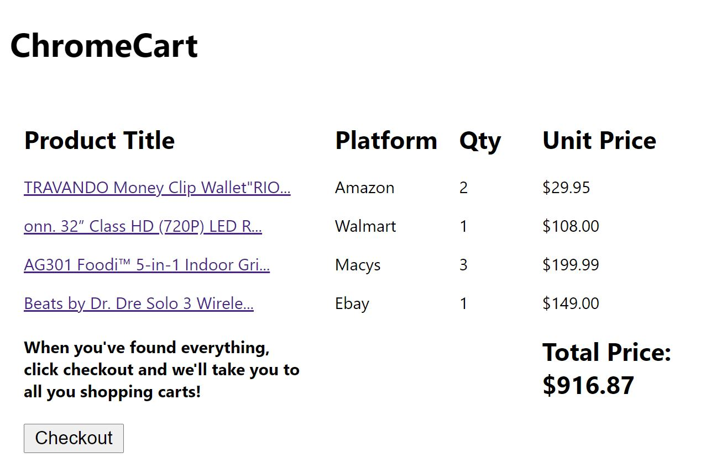

# ChromeCart

## Overview

This Chrome extension allows a user to add items from multiple online shopping sites to one, easy to access cart! All items are synced with a user's account, so they can add items from any device and not lose progress.

If a user wants to add an item from a site to their ChromeCart, they can simply press the "Add to Cart" button from the original site and their item will be added to their ChromeCart! For instance, a user finds the item below and wants to add it to their ChromeCart. After pressing on the "Add to Cart" button, they will then see a popup displaying basic info of what they've just added.

They can then repeat this process on any of our supported sites (Amazon, Ebay, Macy's, and Walmart), adding as many items as they'd like. After they've added all the items they want, or if they would like to see what they've added so far, they can simply click on our extension and see the below popup.

As shown above, the popup will display every item the user has added with a link to the item's page, the platform the user added the item from, the quantity of that item they want, and the unit price of the item. Additionally, the total price (excluding shipping and taxes) is displayed.

If the user is content and would like to purchase their items, they can click the "Checkout" button. This will open the shopping cart of each site the user added items from, where they can complete their transactions.

## How to Run This Program
Once we publish this extension, we'll add the link here.

You can run this extension now by doing the following:
* Cloning this repository
* Going to [managing extensions](chrome://extensions/) in Google Chrome
* Turn on "Developer Mode" in the top right
* Click "load unpacked" in the top right
* Click on the main folder for this cloned repository and click "Select Folder"
* That's it! You're good to start adding items from our supported sites. You can view your current ChromeCart by pressing the shopping cart in the top right under extensions

## Known Bugs
We are aware of a few bugs that we are working to correct:
* We are currently unable to extract the "quantity" of an item added from Walmart. The quantity of any item added from Walmart will be 1.
* On some Amazon listings, after adding an item to the cart, a popup will be displayed asking the user if they want to add a protection plan. If the user exits out of this popup, the item gets added to their ChromeCart again

## Future Improvements
Here are some features we'd like to implement in the future:
* Editing the Cart- We'd like to give user's the option to delete items or edit the quantity of items on both their ChromeCart and the shopping cart of the site the item was originally added form
* Adding Support for more Sites- Instead of supporting only four sites, we'd like user's to be able to add an item from any online retail site
* View Cart History- We'd like to save all the ChromeCarts user's have checked out and allow user's to view their cart history
